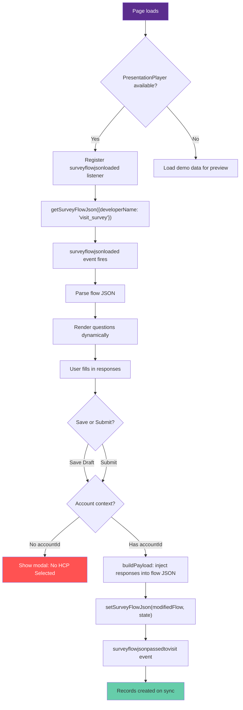

# Survey Flow

Demonstrates `PresentationPlayer.getSurveyFlowJson()` and `PresentationPlayer.setSurveyFlowJson()` for loading, rendering, and submitting survey responses in an LSC presentation.

## Demo Structure

| File | Description |
|------|-------------|
| `01_Survey.html` | Interactive survey UI that loads flow JSON, renders questions graphically, and submits responses |
| `setup_survey.sh` | Repeatable setup script — checks if the survey exists, prints spec if not |

## Features

- **Dynamic survey rendering** — Parses survey flow JSON and renders Slider, Picklist (radio cards), and Free Text question types
- **Purple Immunexis brand theme** — Full branded UI (#5B2D8E primary, #8B5FC7 accent)
- **Account context validation** — Reads `accountId` from `PresentationDOMContentLoaded` config; blocks save/submit with a modal if no HCP context
- **Response injection** — Deep-copies flow JSON and injects user responses into field values before calling `setSurveyFlowJson`
- **Console panel** — Real-time logging of all API calls, events, and payloads for debugging
- **Demo mode** — Falls back to sample data when running outside the LSC mobile app

## API Reference

### getSurveyFlowJson

Retrieves the survey flow JSON for a specified survey. Result arrives via the `surveyflowjsonloaded` event.

```javascript
PresentationPlayer.getSurveyFlowJson({ developerName: 'visit_survey' });
```

| Argument | Description |
|----------|-------------|
| `options` | Object with `developerName` property (the Survey's `DeveloperName`) |

> **Important:** Pass a plain object, NOT a JSON string. `JSON.stringify()` on the argument causes a `"Cannot parse the request type"` error.

### setSurveyFlowJson

Saves or submits survey responses.

```javascript
PresentationPlayer.setSurveyFlowJson(modifiedFlowData, 'submit');
```

| Argument | Description |
|----------|-------------|
| `surveyJson` | The survey flow JSON object **with responses injected into field values** |
| `state` | `'save'` (draft, can be resumed) or `'submit'` (final, creates records) |

### Events

| Event | When |
|-------|------|
| `surveyflowjsonloaded` | After `getSurveyFlowJson` returns data |
| `surveyflowjsonpassedtovisit` | After `setSurveyFlowJson` links data to the visit |

## Survey Flow JSON Structure

The `surveyflowjsonloaded` event returns an object with this shape:

```json
{
  "label": "Visit Survey",
  "fullName": "visit_survey",
  "startElementReference": "...",
  "screens": [
    {
      "fields": [
        {
          "name": "field_api_name",
          "fieldText": "Question text shown to user",
          "fieldType": "Slider | RadioButtons | LargeTextArea | DisplayText",
          "scale": "10",
          "choiceReferences": ["choice_api_name_1", "choice_api_name_2"],
          "dataType": "Number | String"
        }
      ]
    }
  ],
  "choices": [
    {
      "name": "choice_api_name_1",
      "choiceText": "Human-readable choice label"
    }
  ],
  "decisions": []
}
```

### Field Type Mapping

| `fieldType` | Rendered As |
|-------------|-------------|
| `Slider` (or `dataType: Number` with `scale`) | Range slider with numeric display |
| `RadioButtons` / any field with `choiceReferences` | Radio card list |
| `LargeTextArea` / `ShortTextArea` | Textarea |
| `DisplayText` | Skipped (not an input) |

## Response Injection (Critical)

Passing the raw, unmodified flow JSON to `setSurveyFlowJson` does **not** persist responses. You must inject user answers back into the flow JSON fields before submitting:

```javascript
function buildPayload() {
    var data = JSON.parse(JSON.stringify(surveyFlowData)); // deep copy
    var screens = data.screens || [];
    for (var s = 0; s < screens.length; s++) {
        var fields = screens[s].fields || [];
        for (var f = 0; f < fields.length; f++) {
            var field = fields[f];
            var qId = field.name;
            if (qId && responses[qId] !== undefined && responses[qId] !== '') {
                field.value = responses[qId];
                field.fieldValue = responses[qId];
                field.defaultValue = responses[qId];
                // For choice fields, map display text back to choice API name
                if (field.choiceReferences && field.choiceReferences.length > 0) {
                    var choices = data.choices || [];
                    for (var ch = 0; ch < choices.length; ch++) {
                        if ((choices[ch].choiceText || '') === responses[qId]) {
                            field.value = choices[ch].name;
                            field.fieldValue = choices[ch].name;
                            field.selectedChoiceValue = choices[ch].name;
                            break;
                        }
                    }
                }
            }
        }
    }
    return data;
}
```

Key points:
- **Deep copy first** — Never mutate the original flow data
- **Set `value`, `fieldValue`, `defaultValue`** — All three for maximum compatibility
- **Choice fields need API names** — Map the display text (`choiceText`) back to the choice's `name` for `value`/`fieldValue`/`selectedChoiceValue`

## Account Context

The HCP (Account) context comes from the `PresentationDOMContentLoaded` event, not from manual user selection:

```javascript
document.addEventListener('PresentationDOMContentLoaded', function(event) {
    var accountId = event.data.parameters.accountId;
});
```

- `configData.parameters.accountId` is populated when the presentation is opened from a visit with attendees
- If no account context exists, the slide blocks save/submit with a modal popup
- Account name is resolved via `PresentationPlayer.fetchWithParams` SOQL query

## Survey Records (Data Model)

When `setSurveyFlowJson(data, 'submit')` is called:

| Object | Description |
|--------|-------------|
| `SurveyInvitation` | The invitation linking survey to a participant |
| `SurveyResponse` | One per submission, parent of question responses |
| `SurveyQuestionResponse` | One per answered question |
| `SurveyQstnResponseOffline` | Offline staging table (mobile); syncs to `SurveyQuestionResponse` on sync |

Query to verify responses were saved:
```sql
SELECT Id, QuestionId, ResponseValue FROM SurveyQstnResponseOffline
```

## Flow



## Lessons Learned / Gotchas

### Surveys Cannot Be Created Programmatically

Salesforce Survey objects (`Survey`, `SurveyVersion`, `SurveyPage`, `SurveyQuestion`, `SurveyQuestionChoice`) are **all locked from programmatic creation**. Every path fails:

| Method | Error |
|--------|-------|
| REST API (`/sobjects/Survey`) | `INVALID_TYPE` or not creatable |
| Apex DML (`insert new Survey(...)`) | DML not allowed |
| Tooling API | Not supported |
| Metadata API | Not a metadata type |

**Solution:** Create surveys manually in the Survey Builder UI (`/lightning/o/Survey/new`). Use `setup_survey.sh` for a repeatable spec.

### IsTemplate Prevents Loading

If a survey's `SurveyVersion.IsTemplate = True`, `getSurveyFlowJson` will **not** return it. The `IsTemplate` flag cannot be changed via API after creation. Ensure the survey is created as a standard survey, not a template.

### getSurveyFlowJson Argument Format

```javascript
// CORRECT — plain object
PresentationPlayer.getSurveyFlowJson({ developerName: 'visit_survey' });

// WRONG — stringified JSON causes "Cannot parse the request type" error
PresentationPlayer.getSurveyFlowJson(JSON.stringify({ developerName: 'visit_survey' }));
```

### Zip File Structure

LSC presentation zips must have files at the **root level** — no parent folder nesting:

```bash
# CORRECT — zip from inside the directory
cd examples/11_Survey && zip -r ../11_Survey.zip .

# WRONG — creates 11_Survey/ prefix inside the zip
zip -r 11_Survey.zip examples/11_Survey/
```

### Mobile Only

Both `getSurveyFlowJson` and `setSurveyFlowJson` are **mobile only** — they do not work in the web player. The demo slide includes a fallback demo mode for browser preview.

### PresentationDOMContentLoaded Fires Once

The `PresentationDOMContentLoaded` event fires exactly once when the slide loads. It provides `configData.parameters.accountId` from the visit context. Do not rely on user interaction for account selection — the context must come from the visit.

## Setup

1. **Create the survey** (if it doesn't exist):
   ```bash
   ./setup_survey.sh [org-alias]
   ```
   Follow the printed spec in the Survey Builder UI. Activate the survey version after saving.

2. **Deploy the zip**:
   Upload `11_Survey.zip` as a presentation in the LSC org. Ensure files are at root level in the zip.

3. **Open from a visit**: The presentation must be opened from a visit with an attendee selected so that `accountId` is available in the config context.

## See Also

- [06_Visit_Management](../06_Visit_Management/README.md) for `createVisit` and `updateFeedback`
- [05_Data_Query](../05_Data_Query/README.md) for `fetchWithParams`
- [16_Create_Visit](../16_Create_Visit/README.md) for visit creation flow
