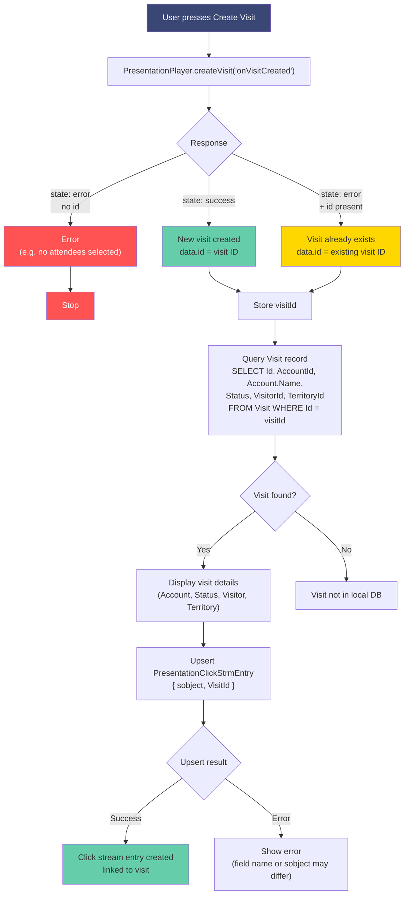

# createVisit Function

Demonstrates `PresentationPlayer.createVisit()` for creating visits during an LSC Intelligent Content presentation session.

## Demo Structure

| File | Description |
|------|-------------|
| `01_Create_Visit.html` | Create Visit button with current user/territory display and automatic Visit record query |

## Features

- **Create Visit button** — Calls `PresentationPlayer.createVisit()` to create a visit for selected attendees
- **Current User display** — Queries `User` to show the logged-in user
- **Territory display** — Reads `activeTerritoryName` from `UserAdditionalInfo.Preference` JSON
- **Auto-query** — After visit creation, queries the Visit record to show Account name and visit details
- **Results panel** — Shows the full request/response chain
- **Explain panel** — Slide-out documentation with syntax, responses, and limitations

## Syntax

```javascript
PresentationPlayer.createVisit(callbackMethod)
```

| Argument | Description |
|----------|-------------|
| `callbackMethod` | String name of a global callback function |

## Success Response

```json
{
  "state": "success",
  "id": "<parent_visit_uid>"
}
```

## Error Response

```json
{
  "state": "error",
  "errorMessage": "<error>",
  "id": "<optional_id_of_previously_created_visit>"
}
```

## What Happens on Success

When `createVisit` succeeds, the following records are automatically created and linked to the visit:

- **ProviderVisit**
- **ProviderVisitProdDetailing**
- **ProviderVisitDetailingProductMessage**
- **PresentationForum**
- **PresentationClickStreamEntry**

Users can select the Visit button in the presentation player menu to open the visit. All presentation metrics tracked during the session are linked to the visit.

## Flow



## Test Paths

| # | Scenario | Expected Result |
|---|----------|-----------------|
| 1 | Fresh session, attendees selected | `{"state":"success", "id":"<visit_id>"}` |
| 2 | Fresh session, no attendees | `{"state":"error", "errorMessage":"Select at least one attendee."}` |
| 3 | Visit already created this session | `{"state":"error", "errorMessage":"Visit is already created", "id":"<existing_id>"}` |
| 4 | Player opened for existing visit | `{"state":"error", "id":"<existing_id>"}` |

> **Note:** The official Salesforce documentation states "If no attendees were selected before the visit was created, the account field on the visit is blank," implying zero attendees should work. In practice, the player requires at least one attendee and returns an error otherwise.

## Important Notes

- **One visit per session** — Invoke `createVisit` only once per presentation session. Subsequent calls return the existing visit ID.
- **Attendees required** — Select attendee(s) in the player menu before opening the presentation. If no attendees are selected, the Account field on the visit is blank.
- **Do not use `upsert` for visits** — Use `createVisit` instead. The `upsert` function has blacklisted fields (`Status`, `providervisitid`) that prevent proper visit creation.
- **Mobile only** — Supported only in the Life Sciences Cloud mobile app.
- **Mustache variables** — `createVisit` does not populate visit details into Mustache variables.

## Territory from UserAdditionalInfo

The current user's territory is read from `UserAdditionalInfo.Preference`, a JSON field containing:

```json
{
  "activeTerritoryName": "San Francisco North",
  "activeTerritoryId": "0MIHs000000tvjXOAQ"
}
```

Query: `SELECT Id, Preference FROM UserAdditionalInfo WHERE UserId = '<userId>'`

## See Also

- [15_Upsert_Account](../15_Upsert_Account/README.md) for `upsert` function (Account/HealthcareProvider)
- [05_Data_Query](../05_Data_Query/README.md) for `fetchWithParams`
- [Salesforce Help: createVisit Function](https://help.salesforce.com/s/articleView?language=en_US&id=ind.lsc_presentation_function_createvisit.htm&type=5)
